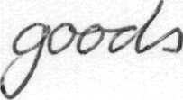
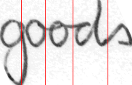

# HTRSegmenter
A Handwritten Text Recognition(HTR) based cursive character segmenter, using a CNN-LSTM model, initially trained to recognize handwritten words 

## Input Image


## Output Image


## Dependencies
- OpenCV >= 3.4.2
- Tensorflow >= 1.9.0
- Scikit-Image >= 0.15.0

## Setup
- Install on Linux-64 using anaconda by creating a virtual environment:  
```conda create --name char_segment -f conda_linux_env.txt```

OR

- Install using requirements.txt  
```pip install -r requirements.txt```

## Usage
- Add the word images you want to segment into character in the 'input' folder
- Change the directory to src  
```cd src```

- Run main.py  
```python main.py```

- Check results in 'output' folder
